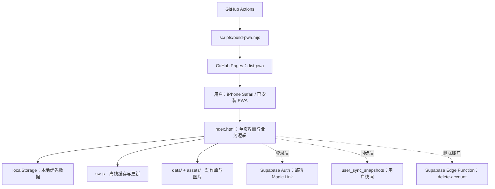

# FitMine 技术架构与维护指南

> 文档基线：`fb85812`（2026-09-20）  
> 适用范围：当前 GitHub Pages 生产 PWA、可选的 Supabase 同步能力，以及仓库内预留的 iOS / Cloudflare 发布路径。  
> 本文描述已落地的实现与明确待验证项；不包含运行配置、测试步骤或故障排查。

## 1. 产品与运行形态

FitMine 是一款以抗阻训练为核心的移动端 PWA。用户可离线完成评估、生成四周计划、浏览动作库和记录训练数据；登录账户后，当前设备上的 FitMine 数据会以快照形式备份到 Supabase，并可在另一设备恢复。

当前面向用户的生产入口是 GitHub Pages：

`https://katherine54321.github.io/fitlog_NSCA_tool/`

真正的前端实现是原生 HTML、CSS 与 JavaScript，主要代码集中在 [index.html](../index.html)。仓库同时保留 Next / React、Cloudflare D1 的脚手架文件，但它们不是当前 PWA 的用户请求处理路径，后续开发不应误把它们当作现有业务模块。

## 2. 技术栈与职责

| 层级 | 当前实现 | 职责 |
| --- | --- | --- |
| 用户界面 | 原生 HTML / CSS / JavaScript | 单页路由、页面渲染、训练算法、表单状态和交互 |
| 离线能力 | Web App Manifest、Service Worker | 安装到主屏幕、缓存应用壳和训练数据资源 |
| 训练内容 | JSON、JavaScript 数据文件、静态图片 | 180 个动作及其分类、说明和两张动作示意图 |
| 本地数据 | 浏览器 `localStorage` | 离线保存计划、评估、训练完成状态、训练组和账户会话 |
| 云端认证和同步 | Supabase Auth / PostgreSQL / Edge Function | 邮箱登录、快照备份与恢复、账户删除 |
| Web 发布 | GitHub Actions + GitHub Pages | 构建 `dist-pwa/` 并发布静态文件 |
| 可选原生壳 | Capacitor iOS | 将同一 PWA 打包进 iOS WebView；当前 PWA Web 版不依赖它 |
| 可选替代托管 | Cloudflare Workers 静态资产 Worker | 仍保留部署路径，但不是当前用户入口 |

## 3. 代码与资产边界

| 路径 | 角色 | 维护要点 |
| --- | --- | --- |
| [index.html](../index.html) | 当前 PWA 主入口、样式和绝大部分业务逻辑 | 单文件规模大；修改时要注意页面状态、哈希路由和本地数据兼容性 |
| [data/exercises-v1.json](../data/exercises-v1.json) | 动作库主数据 | 每条动作包含中文名、英文名、分类、器械、肌群、说明和本地图路径 |
| [data/exercise-library-data.js](../data/exercise-library-data.js) | 浏览器直接加载的动作库数据 | 由导入脚本生成，需与 JSON 内容保持一致 |
| [assets/exercise-images/](../assets/exercise-images) | 动作起止图 | 文件名与动作 `id` 对应，避免随意重命名 |
| [sync/fitlog-sync.js](../sync/fitlog-sync.js) | 账户、Magic Link、备份恢复、删除账户前端客户端 | 不保存服务端特权密钥；只使用公开 anon key 和用户会话 |
| [supabase/migrations/0001_fitlog_schema.sql](../supabase/migrations/0001_fitlog_schema.sql) | Supabase 关系型数据模型、RLS 策略 | 结构化模型已准备，但当前客户端主要写快照表 |
| [supabase/functions/delete-account/index.ts](../supabase/functions/delete-account/index.ts) | 账户删除 Edge Function | 校验调用用户后使用服务端权限删除 Supabase Auth 用户 |
| [manifest.webmanifest](../manifest.webmanifest)、[sw.js](../sw.js) | PWA 安装与离线缓存 | 资源变更必须经过构建脚本，避免已安装 PWA 使用旧缓存 |
| [scripts/build-pwa.mjs](../scripts/build-pwa.mjs) | 静态 PWA 构建 | 复制生产资源并根据内容生成缓存标识 |
| [.github/workflows/deploy-pages.yml](../.github/workflows/deploy-pages.yml) | GitHub Pages 发布流程 | `main` 提交会构建并发布 `dist-pwa/` |
| [ios/](../ios) | Capacitor iOS 工程 | 仅在原生 App 发布或真机 WebView 验证时参与 |
| [worker/pwa-static.ts](../worker/pwa-static.ts) | Cloudflare 静态 PWA 备用入口 | 提供 SPA 回退；与当前 Pages 发布相互独立 |
| [app/](../app) 与 [worker/index.ts](../worker/index.ts) | Next / Vinext、Cloudflare D1 脚手架 | 当前未承载 FitMine PWA 业务；启用前需重新设计数据接入边界 |

## 4. 页面与前端状态

### 4.1 单页路由

页面通过 URL 哈希切换，而不是服务器路由。主模块为：

| 哈希 | 模块 | 主要能力 |
| --- | --- | --- |
| `#home` | 首页 | 当前四周计划、训练完成进度、当天训练入口 |
| `#evaluation` | 评估 | 风险筛查、心肺评估、力量评估 |
| `#plan` | 计划 | 三项输入、四周周期、每周训练日和历史计划 |
| `#training` | 动作库 | 抗阻、热身、拉伸动作检索与详情 |
| `#workout-detail` | 训练日详情 | 某训练日的热身、主项、拉伸与完成训练 |
| `#exercise-detail` | 动作详情 | 动作示意、步骤、训练提示 |
| `#records` | 记录 | 动作记录、训练记录、力量进展与补充负荷 |

`syncModuleTabs()` 负责将哈希转换为模块显示状态。它会先识别 Supabase 回调中的 token，避免普通路由逻辑提前清除登录回调参数。

### 4.2 本地优先数据模型

业务数据首先保存在当前浏览器的 `localStorage`。主要键如下：

| 键 | 内容 |
| --- | --- |
| `fitlog-profile` | 训练历史、目标、每周训练天数及辅助风险资料 |
| `fitlog-risk`、`fitlog-risk-result` | 风险筛查答案及计算结果 |
| `fitlog-cardio-assessment`、`fitlog-strength-assessment` | 两类体能评估表单快照 |
| `fitlog-fitness-history` | 心肺与力量评估历史 |
| `fitlog-plan-saved`、`fitlog-plan-template`、`fitlog-plan-start-date` | 当前计划是否存在、模板和周期起始日 |
| `fitlog-plan-history` | 已归档的计划摘要 |
| `fitlog-plan-completed` | 已完成训练日 ID 集合 |
| `fitlog-records` | 已完成训练日会话摘要 |
| `fitlog-training-set-logs` | 动作训练组、计划动作补充负荷和估算 1RM |
| `fitlog-sync-session`、`fitlog-sync-state` | Supabase 会话和上次成功同步时间 |

所有同步候选键以 `fitlog-` 为前缀。同步客户端排除会话与同步状态键，再将其余值打包，从而避免把 access token 备份到云端快照中。

## 5. 业务模块与计算逻辑

### 5.1 风险评估

风险评估接收 15 个健康、病史和生活方式问题，并结合年龄、生理性别及用户填写的动作限制信息。

1. 出现胸痛、晕厥、医生限制、确诊慢性疾病或近期手术等红旗项时，结果为高风险。
2. 无红旗但出现两个及以上心血管风险因素，或存在用药、损伤、动作限制时，结果为中风险。
3. 其余情况为低风险。

风险结果不是诊断。它在计划生成中作为边界条件：高风险最多生成两个低强度训练日；中风险在原计划描述中加入前 2–4 周降低总量与增加余力要求。

### 5.2 心肺和力量评估

心肺评估以 2.4 km 跑步时间、体重、年龄和生理性别估算 VO2max，并用内置年龄和性别分档表给出区间。力量评估以器械卧推或器械腿举的 10RM 估算 1RM，计算相对力量并与内置百分位表比较。

评估结果会保存为本地历史记录，同时用于首页和评估页面的结果展示。当前计划生成器的核心输入仍是训练目标、训练历史和每周可训练天数；风险结果只承担安全限制角色。

### 5.3 四周抗阻计划生成

计划生成入口为 `buildPlan(profile)`。其决策顺序是：

目标处方遵循当前代码中固化的抗阻目标范围：

| 目标 | 负荷与次数 | 组数 | 休息 |
| --- | --- | --- | --- |
| 增肌 | 67–85% 1RM；6–12 次 | 3–6 组 | 30–90 秒 |
| 力量 | ≥85% 1RM；≤6 次 | 2–6 组 | 2–5 分钟 |
| 爆发力 | 75–90% 1RM；1–5 次 | 3–5 组 | 2–5 分钟 |
| 肌耐力 | ≤67% 1RM；≥12 次 | 2–3 组 | ≤30 秒 |

分化结构由经验与天数决定：初学者最多三天全身训练；中级四天采用上下肢分化、五至六天采用 PPL；高级训练者在三天可采用 PPL，在四天采用上下肢分化，五至六天采用 PPL。增肌计划有独立的训练日文案和训练重点。

周期结构固定为四周：动作适应、容量递进、目标强化、减载巩固。第 4 周将训练组数相对前期降低约 40–50%，同时保留动作练习。

### 5.4 训练日、完成状态与记录

计划根据当前周次与分化结构生成训练日。每个训练日会组合热身、主项与拉伸动作；训练日 ID 包含周期起点、目标、训练历史、每周天数、周序号和日序号，因此同一计划中的完成状态可按周准确追踪。

用户点击“完成训练”后，应用保存训练会话摘要与完成训练日 ID。训练记录页将展示已完成计划内动作；若动作没有负荷，用户可以补充重量。补充负荷会保存为训练组日志，并用 Brzycki 公式计算估算 1RM。力量进展图从这些可用训练组中选择动作和时间序列绘制。

### 5.5 动作库

动作库按 `libraryType` 分为 `resistance`、`warmup` 和 `stretch`，动作条目按部位、器械、难度、推拉属性、主肌群和辅助肌群检索。图片为静态本地资源，页面采用延迟观察机制加载图像，避免一次性绘制全部动作图片。

`scripts/import-exercises.mjs` 可从开源动作数据库导入源数据，并叠加项目内中文术语、扩展动作和中文指导文本，生成 JSON、浏览器脚本与图片文件。导入结果会直接影响动作库、计划动作匹配和历史记录中的动作 ID。

## 6. 账户、同步与数据删除

### 6.1 登录回调

登录使用 Supabase 邮箱 Magic Link。前端向 `/auth/v1/otp` 提交邮箱，并将当前 PWA URL 作为 `email_redirect_to`。邮件链接返回后，客户端支持两种会话形式：

- URL hash 中直接带 `access_token` 和 `refresh_token`；
- URL query 中带 `token_hash` 与 `type=email`，客户端再调用 `/auth/v1/verify` 获取会话。

会话只保存在本机 `fitlog-sync-session`；路由和历史地址会在会话取得后移除 token 参数。

### 6.2 快照同步

当前同步并不逐行写入计划、训练和评估结构化表，而是将所有本地 `fitlog-*` 业务数据序列化为一个 `snapshot`，按 `user_id` 写入 `user_sync_snapshots`。

登录成功后，应用先尝试拉取比本地状态更新的远端快照；若无可恢复快照，再进行首次备份。在线、页面离开和“立即同步”均会尝试提交当前快照。快照表以用户 ID 为主键，因此每位用户只有一份当前云端快照。

### 6.3 隐私同意与账户删除

登录成功后，客户端记录 `privacy` 和 `health_data` 两项同意记录。账户删除通过 Edge Function 完成：函数先根据调用方 Bearer token 获取用户，再用服务端权限删除该 Auth 用户；关联数据库记录因外键级联删除。前端在成功后清除本机的 `fitlog-*` 数据。

## 7. Supabase 数据架构

迁移文件定义了完整的长期结构化数据模型，所有个人表均启用 RLS，并通过 `auth.uid()` 或关联计划 / 训练会话约束到当前用户。

| 领域 | 表 |
| --- | --- |
| 用户与同意 | `profiles`、`user_consents` |
| 动作内容 | `exercises`、`exercise_media` |
| 计划 | `training_plans`、`plan_workouts`、`plan_workout_exercises` |
| 训练日志 | `workout_sessions`、`workout_exercises`、`workout_sets` |
| 评估 | `risk_assessments`、`cardio_assessments`、`strength_assessments` |
| 当前同步桥接 | `user_sync_snapshots` |
| 商业化预留 | `subscriptions`、`store_transactions` |
| 账户生命周期 | `account_deletion_requests` |

计划与训练明细表包含动作名称和指导快照字段，目的是让未来动作库更新后，历史计划和训练记录仍可保留当时的动作语义。`subscriptions` 与 `store_transactions` 已在迁移中建模，但当前前端没有订阅、支付或交易验证流程。

## 8. PWA、iOS 与发布链路

### 8.1 PWA 更新模型

`sw.js` 预缓存页面壳、Manifest、图标、动作库和占位图；导航请求优先从网络取得最新页面，离线时回退到应用壳；运行时配置优先网络获取，失败才回退缓存。其他静态资源采用缓存优先策略。

构建脚本会根据页面、Manifest、图标、运行时配置、同步脚本和动作库数据计算内容摘要，并将摘要写入发布产物中的缓存名。这样每次影响 PWA 内容的发布都能激活新的缓存空间，删除旧缓存，并让已安装 PWA 获得新资源。

### 8.2 GitHub Pages

`main` 分支的提交触发 GitHub Actions：检出代码、使用 Node 22 构建 `dist-pwa/`、写入 `.nojekyll`、上传 Pages 制品并部署。GitHub Pages 是当前对外分享和“添加到主屏幕”的 Web 版本来源。

### 8.3 Capacitor iOS

Capacitor 的 Web 根目录是 `dist-pwa/`。iOS 工程位于 `ios/`，其中 `AppDelegate.swift` 负责原生壳启动。`FitLogSync` 对 `Capacitor.Plugins.App.appUrlOpen` 有监听，因此原生壳将来可把邮箱登录回调交给同一套网页会话处理逻辑。

### 8.4 Cloudflare 静态 Worker

`worker/pwa-static.ts` 使用 Assets binding 提供静态文件，当普通 GET 页面路径不存在静态文件时回退 `index.html`，支持 SPA 访问。该链路仍可用于备用网址，但当前正式分享地址不是 Workers 域名。

## 9. 已实现、待验证与优化优先级

### 已实现

| 能力 | 当前状态 | 依据 |
| --- | --- | --- |
| 抗阻四目标、训练历史与周频次生成四周计划 | 已实现 | 目标处方、分化选择、四周波动和训练日动作编排均在前端实现 |
| 风险评估对计划施加限制 | 已实现 | 高风险天数与强度降级、中风险前期保守约束已接入生成器 |
| 动作库与热身、拉伸分类 | 已实现 | 180 条动作数据和本地图片随 PWA 发布 |
| 训练完成、补充负荷、1RM 与力量趋势 | 已实现 | `fitlog-records` 与 `fitlog-training-set-logs` 驱动记录模块 |
| 离线运行与内容缓存更新 | 已实现 | Service Worker、内容摘要缓存名和客户端更新检查已接入 |
| GitHub Pages 自动发布 | 已实现 | `main` 分支的 Pages 工作流已作为当前发布路径 |
| Magic Link 登录、快照备份、恢复和删除接口 | 已实现 | `sync/fitlog-sync.js` 与删除 Edge Function 已实现 |
| 绿色 F + 蓝色杠铃 PWA 品牌图标 | 已实现 | SVG、192/512 PNG、Manifest 和构建缓存已同步更新 |

### 待验证与优先级

| 优先级 | 项目 | 当前事实 | 建议下一步 |
| --- | --- | --- | --- |
| P0 | 面向外部用户的邮件发信 | 已观察到 Supabase 默认邮件服务触发频率限制；默认服务不适合作为外部用户生产发信渠道 | 完成自定义 SMTP 的真实收件人登录闭环，再向外部用户开放账户功能 |
| P0 | 多设备恢复与账户删除真实闭环 | 代码与云端结构已具备，但此前明确跳过了跨设备恢复、删除验证 | 以两个真实测试账户完成备份、另一设备恢复、删除后不可恢复的验证 |
| P1 | 快照冲突策略 | 当前每用户一份快照，按 `client_updated_at` 判断是否恢复，不做字段级或记录级合并 | 在多人或多设备常态使用前定义“最后写入获胜”提示或升级为结构化增量同步 |
| P1 | 结构化 Supabase 表接入 | SQL 中已定义计划、会话、组、评估等表和 RLS；PWA 当前不直接写这些表 | 分阶段将训练会话与训练组先迁到结构化表，再迁计划和评估历史 |
| P1 | iPhone 已安装 PWA 的更新体验 | 缓存版本自动更新已实现；不同 iOS 版本的主屏幕图标刷新时机仍由系统控制 | 在目标 iOS 版本上确认首次安装、网页更新、关闭重开、图标更新的实际表现 |
| P2 | 单文件前端可维护性 | `index.html` 同时承载样式、模板、路由和业务算法 | 先抽离计划生成、训练记录、评估和路由为独立 ES 模块，保持行为不变后再重构 UI |
| P2 | 动作数据版本管理 | 动作 ID 同时服务于计划、图片和记录；导入来源与本地增强数据耦合 | 为动作库建立显式版本号、变更日志和旧 ID 映射，保护历史记录可读性 |
| P2 | 商业化模型 | 订阅与交易表已预留，前端、服务端校验和用户权益尚未实现 | 明确免费版与订阅权益后，再设计支付、回执验证和恢复购买 |
| P2 | 原生 App 路径 | Capacitor iOS 工程存在，但当前主要以 Pages PWA 使用 | 若决定上架，再完成真机回调、签名、隐私申报和 App Store 流程 |

## 10. 后续维护原则

1. 计划和训练记录的动作引用必须优先使用稳定的 `exerciseId`，展示时才使用动作名称；不要只靠中文名称关联历史数据。
2. 修改周期化规则时，先明确是影响新生成计划，还是也要解释既有计划；当前已保存计划是从本地输入和算法即时重建的，不是完整的不可变计划快照。
3. 同步层改动要兼容已有 `fitlog-*` 键；在结构化迁移完成前，不能删除快照表或轻易修改快照字段含义。
4. 需要触达已安装 PWA 的页面、图标、数据或同步脚本时，应通过构建脚本发布，确保缓存内容摘要变化。
5. 新增任何健康、训练或账户数据时，先明确其本地存储位置、同步范围、删除路径以及是否需要 RLS 保护。
6. 保持“训练参考而非医疗诊断”的产品边界；风险评估仅用于训练安全分流，不能以诊断或治疗功能表述。
